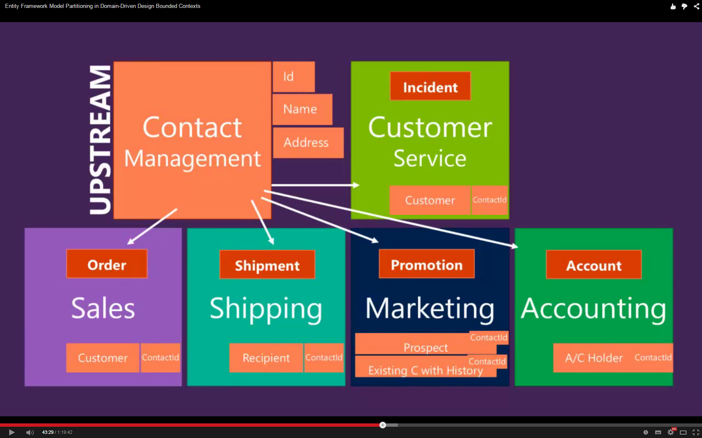
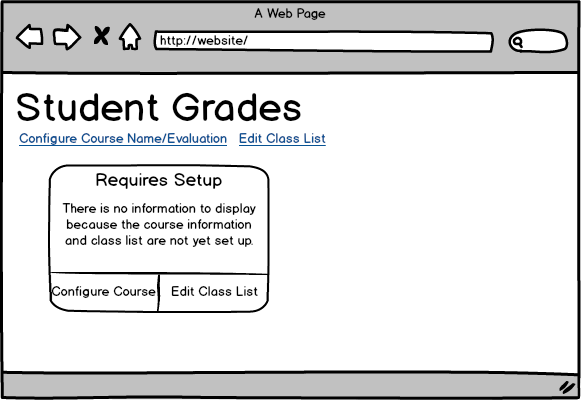
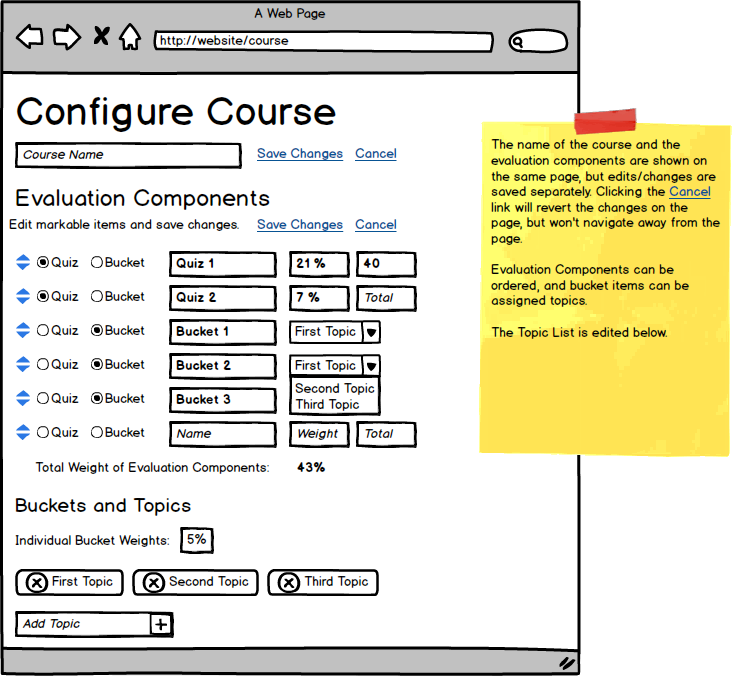
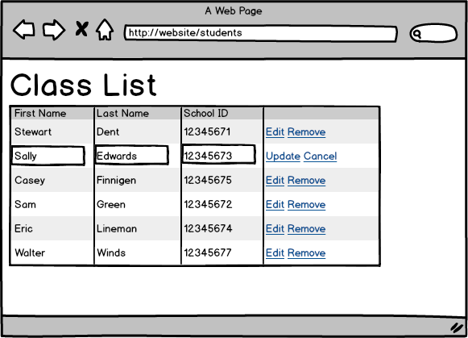

# Student Marks - System Analysis

## Overview

Instructors need a system to better track the marks that they assign to students. Often, instructors have used their own custom Excel spreadsheets to record student marks. The great advantage of spreadsheets is that they allow the instructor a quick and easy way to set up for the variety in course evaluations and have allowed instructors the ability to fine-tune it for their own desired level of recording. Additionally, if an instructor was offering "bonus" marks, their spreadsheets could accommodate this without breaking the "rules" of final marks being between 0 and 100. (The downside of working with spreadsheets is that if there is an error in the formula, then calculations can be off, affecting the marks they finally record for the students.)

This flexibility in granular tracking of marks and setup of weighted evaluations is a desired aspect in the new system.

----

## Technical Guidance

**Shared Types** - Generally speaking, in the domain it's more important to keep your domain objects within your bounded context and not to share them accross contexts. The reason for this is that each bounded context has its ubiquitous language whose meaning is clearly understood *only within its bounded context*, and sharing domain objects among contexts muddies the water as much as adding "alternate" definitions in the ubiquitous language. Having said that, there is some sharing that can be done, following these guidelines.

* **Shared Kernel** - "Reduce duplication, but not eliminate it" (*Eric Evans, DDD book*)
  * Tightly coordinated Entities and Value Objects
  * Common schema and behaviour
* **Inheritance**
  * Infrastructure - `WritableEntity`, `ReadableEntity`
  * Not domain types
  * Favor composition (interfaces) over inheritance
* **OOP Principles**
  * "*DRY" - Don't Repeat Yourself
    * Applies to the idea of Re-Use Code
    * Re-Use is different from *Re-Purpose* - When your types are used for different purposes (aka, in different contexts), duplication is not just OK, it's essential
  * Data Model != Domain Model
  * A parameterless constructor is ok, and sometimes needed to work with some infrastructure frameworks, such as Entity Framework
* **Shared Data** (and *Database*)
  * Only let one bounded context have CRUD functionality on a given entity
  * EF Code Migrations - Have a "Master Context" from which you can do database migrations

Remember... Let DDD drive your **domain design**, not EF. Honour the **Boundaries** of Bounded Contexts. Recognize that "common types" are **not so common**. **Re-purposing types is hard** - harder than you think. **Re-purposing data is hard** - harder than you think. Moving data *between* Bounded Contexts is easier - easier than you think.

EF Concerns inside Bounded Context

* **Private Setters** - One:One Relationships *(Favor Value Objects)*
  * **EF Populates via reflection** - Requires FK & Nav. Prop
* **Value Objects** - Favor 1-way navigations
  * **Map as Complex Types** - EF can handle it
    * Jimmy Bogard EF&DDD Scorecard: Wonky issues around null values. He prefers entities
* **EF Rules Mess up my aggregate**
  * **Ditch EF relationship magic for Writes** *(Adapt CQRS concepts?)*

------

### Course Evaluation Bounded Context

Central to the working of the system is setting up a set of **Evaluation Components** for a **Course**. First, a **Course** (identified by its course number and/or name) is "presumed" to exist in the system and is the aggregate root. For the **Course**, we may add an **Evaluation Component** (consisting primarily of a title and weight). **Evaluation Components** may or may not be controlled evaluations (a controlled evaluation is one that has some form of invigilation or supervision during the evaluation, whereas an uncontrolled evaluation is completed by the student on their own, without direct supervision). An **Evaluation Component** may be broken down into **SubComponents**. These **SubComponents** may be *weighted items or simply Pass/Fail items. Alternatively, the **SubComponents** may be a straight equal distribution of its parent evaluation weight. A **SubComponent** is the most granular level of marking recorded; a **SubComponent** cannot be broken down into smaller **SubComponents**.

Some of the rules around setting up **Courses** and their **Evaluation Components**:

* A **Courses** name and number must be unique (with the number often acting as the public identifier of a course).
* A **Courses** **Evaluation Components** cannot produce a total weight over 100. A **Course** can have its **Evaluation Components** weights total to less than 100.
* An **Evaluation Components** **SubComponents** must all be the same type: either individually weighted, equal distribution, or as Pass/Fail components.
* Individual **SubComponent** weights must add up to the weight of its main component

#### User Stories

* *Configure Course Evaluations*
  * **I Want** to *set the evaluation components* for a course
  * **So That** I have a basic framework to enter student marks
    * *New course with evaluation components*
    * *Existing course with evaluation components*
    * *Course with partial evaluation components*
    * *Course with evaluation components and subcomponents*

### Course Offering Bounded Context

Over time, **Courses** are delivered with their **Planned Evaluation Components**. These **Course Offerings** have a specific start and end date. Additionally, there may be multiple instances of a given **Course Offering**, known as **Sections**. An **Instructor** is assigned to each **Section**. For these **Course Offerings** and **Sections**, there may be some variation in the **SubComponents**, according to the **Instructors** preferences, but none are allowed in the main **Evaluation Components**.

In this context, the **CourseOffering** is the aggregate root.

* A **Course** is available to be used as a **Course Offering** if it has a set of **Evaluation Components** that are complete (their total weight equals 100). Otherwise, the **Course** is not ready to be used as a **Course Offering**.
* The **Evaluation Components** can be edited for their **SubComponents** only.
* **SubComponents** cannot be modified once marks have been assigned.

#### User Stories

* *Create Course Offering Sections*
  * **I Want** to *create course offering sections*
  * **So That** instructors can enter marks for students
    * *Create a single section*
    * *Create multiple sections*
* *Customize Evaluation Components*
  * **I Want** to *modify evaulation subcomponents*
  * **So That** I can customize the evaluation of my section
    * *Remove subcomponents*
    * *Add subcomponents*
    * *Modify subcomponents*

### Course Enrollment Bounded Context

**Students** can be added to a **Section**. **Student** enrollement in a section is done in bulk at the start of the term, but may be modified as the term progresses. **Students** may be removed, added, or transferred between **Sections**.

In this context, the **Section** is the aggregate root.

* **Students** are added to a **Section** "in-bulk".
* Individually, a **Student** can be added/withdrawn/transferred from a section.

#### User Stories

* *Set up initial class list*
  * **I Want** to *enter my students in my section*
  * **So That** I am ready to enter marks for my students
    * *Add multiple students to my section*
* *Modify class list*
  * **I Want** to *modify my class list for my section*
  * **So That** when I enter student marks, I focus only on students currently in my course
    * *Withdraw student from my section*
    * *Add student to my section*
    * *Transfer student to another section*

### Student Grading Bounded Context

**Marks** are assigned to **Students** for specific **Evaluation Components** and **SubComponents**. Depending on the kind of evaluation, a **Mark** may be some earned or assigned value (e.g.: 45/50) or might be a record of whether an item is a pass or a fail.

In this context, the **Section** is the aggregate root.

* **Marks** are assigned directly for **SubComponents** or **Evaluation Components** that do not have **SubComponents**.
* Before earned marks can be assigned to students for a **SubComponent** or **Evaluation Component**, the component's total possible marks should be set.
* Usually an Earned Mark is recorded for a student, and that translates into a percent on the component (earned/possible). Occassionally, however, an assigned mark (a percent) can also be entered for the student.
* Student marks can be entered in bulk (the preferred way), though they can be individually edited.

#### User Stories

* *Bulk enter student marks*
  * **I Want** to *enter marks for multiple students* for a given evaluation
  * **So That** I can simply the recording of my marks
    * *Scenario*
* *Edit student marks*
  * **I Want** to *modify individual student marks*
  * **So That** I can make additions and corrections to student marks
    * *Scenario*

----

As an instructor, I need to track marks for my students. For any given course, this entails a few tasks. Firstly, as part of initializing my tracking, I need to know/enter my class list (student first/last name + school id) and know/enter the different things I need to get marked (mark item, weight, etc.). After that, I need to just enter my marks, which I would like to do in a "bulk" fashion.

* **Q)** Are there any rules around the values of marks?
  * **R)** Yes.
    * Total weighted marks must equal 100.
    * Non-pass/fail items will have a Total Potential Marks > 0
    * Earned Marks must be > 0 && <= Total Potential Marks
    * Total grade at end of course must be <= 100

* **Q)** Can you describe further what you mean when you say you enter your marks in "bulk"?
  * **R)** Basically, after I mark an item like a quiz, I have all the quiz marks for the class, and I want to just pull up a list of the students and enter each student's quiz mark, and then just save the marks after I've entered them.
  * *Implementation Note* - When it comes to entering marks for students, it would be easiest to be able to click the marked item and then just enter each student's mark by using tab/alt-tab to go from student to student, and then bulk-add the class marks for the marked item.

As an example, my course may be set up with two quizzes (21% and 7%) and a set of all-or-nothing exercises (24 worth 3% each and totalling to 72%). Each quiz can be out of a differnt set of marks; for example, the first quiz is out of 40 marks. Since the exercises are worth all-or-nothing, they don't have individual marks (they are pass/fail). Exercises are grouped under topics, to make tracking a large number of exercises easier.

Here's a sample of some values.

* 21% - Quiz 1
* 7% - Quiz 2
* 72% - Exercises - 3% each
  * Binary Math
  * etc., until I have a set of 24 exercises (24 * 3 = 72%)

Another example might involve a mixture of controlled and uncontrolled evaluations. (A controlled evaluation is one that is invigilated in some form.)

* 20% - Exercises
  * Can vary in #, from 4 to 10 exercises
  * Allow a bonuns exercise
* 45% - In-Class Assessments - controlled
  * Assessment 1
  * Assessment 2
  * Assessment 3
* 35% - Final Project
  * Can be delivered as a "bulk" project, or sub-divided at a later time into "segments" that would have specific due dates
    * 5% - Project Plan and Acceptance Tests
    * 10% - Unit Tests
    * 10% - Core functionality
    * 10% - Presentation Layer

And here is yet another example.

* 30% - Labs
* 20% - Quiz (controlled)
* 15% - Project Plan
* 25% - Project Development
* 10% - Presentation

* **C)** I forgot to mention that the bucket exercises are grouped under topics (to make it easier to track). I tend to have anywhere from one to five buckets per topic, and I like to see the quizzes, topics and buckets ordered according to how they are delivered during the course.
  * **R)** Ok. I wrote that change up in the narrative. I'll reflect that in the screen mockups soon.
  * **R)** The screen mockup is updated.

* **Q)** Can you tell me more about the "all-or-nothing" exercises?
  * **R)** Those exercises are each marked as either a pass/fail. They are fairly easy to do, and for the most part student pass them when they try them. However, sometimes they don't, and I'll explcitly mark them as a fail.
    * *Note* Use **Pass/Fail** as part of the domain language to describe these types of marked items.
  * **Q)** You say that you explicitly mark them as a fail. Do you not enter all the marks (i.e., do you leave any "un-marked", or mark them as incomplete)?
  * **R)** I don't mark them as incomplete, I just don't enter any mark for that exercise. Then, at the end of the course, if there isn't a mark, it's assumed they didn't do it and therefore fail that exercise.
  * **R2** Oh, and sometimes I have to go back to earlier exercises to mark those that the student has turned in later on in the course.
  * **Q)** Are there any due-dates for the exercises?
  * **R)** Sometimes there are fixed due dates, but sometimes I just leave the due-dates open until later on in the course when I give the students a firm drop-dead date to hand in their exercises for marking. After that point, I don't accept late exercises (unless the student has a reason, such as illness or other "life" event).
* **Future** - *Look at these features in future releases*
  * Handle more alternate scenarios for the main stories
  * Handle other types of marked items - labs, group assignments, etc.
  * Track multiple courses - **This Version: *One Course Only*!**
  * Allow changing of course evaluation after marks have been partially entered (e.g.: replace a quiz with two smaller quizzes, or combine one or two labs)
  * Handle student-specific exceptions (combine/average lab mark if one missed, different potential marks for specific student)
  * Handle "bonus" marks (over 100%)
  * More UI cases for bulk-inserting student names (cases of middle names)

When I enter my list of students, it would be easier to just paste in all the student information as one "chunk" and have the system figure out [parse] what the student information is. There would be one student per line, and all the information on each line is separated by spaces, tabs, and/or commas. Each line has the student's name (typically *First Last*, ~~but perhaps with a middle name~~ **(*Note 1*)**) and then ends with the school id for the student.

* **Q)** How complex can the structures be for student names & school Ids?
  * **R)** Actually, this term it's pretty basic. Just *First*, *Last*, and *School ID*
  * **Q)** Can we just accept this simple structure this time around and add edge cases later?
  * **R)** Sure.
  * *Mark this characteristic as future in the narrative:* **(*Note 1*)**

* **C)** The screen mockups look nice!

## Screen Mockups

#### Home-Setup

#### Home-Student Marks

#### Course-Configure

#### Students-Setup

#### Students-Edit

## User Stories

**User Stories** become the basis for System Tests and/or Integration Tests. *All the following user stories are from the perspective of the Instructor, since this is only an Instructor tool at present. Therefore, it can be assumed to start with* **An an Instructor***.*

* *Initialize Course Information*
  * **I Want** to enter the mark structure for the course,
  * **So That** I have the basic framework to enter student marks.
    * *Scenario Title* (Primary)
      * **Given** something **When** action **Then** result
    * *Scenario Title*
      * **Given** something **When** action **Then** result
* Manage Class List*
  * **I Want** to enter a list of students in my class,
  * **So That** I know who to assign marks to.
    * *Scenario Title* (Primary)
      * **Given** something **When** action **Then** result
    * *Scenario Title*
      * **Given** something **When** action **Then** result
* *Enter Student Marks*
  * **I Want** to enter student marks,
  * **So That** I can track each student's progress in the course.
    * *Scenario Title* (Primary)
      * **Given** something **When** action **Then** result
    * *Scenario Title*
      * **Given** something **When** action **Then** result
* *View Class Marks*
  * **I Want** to view marks for the whole class,
  * **So That** I can see the overall progress of my students.
    * *Scenario Title* (Primary)
      * **Given** something **When** action **Then** result
    * *Scenario Title*
      * **Given** something **When** action **Then** result
* *View Individual Student Marks*
  * **I Want** to generate a student-by-student report of marks,
  * **So That** I can give each student a report of their marks.
    * *Scenario Title* (Primary)
      * **Given** something **When** action **Then** result
    * *Scenario Title*
      * **Given** something **When** action **Then** result

----

* *Title*
  * **I Want** ,
  * **So That** .
    * *Scenario Title* (Primary)
      * **Given** something **When** action **Then** result
    * *Scenario Title*
      * **Given** something **When** action **Then** result

----

## Unit Tests

**Unit Tests** are for smaller parts of the system and are done as "units". I'm sub-dividing these down into tests related to the *Application Framework* and those related to the *User Interface* (in this case, a browser). There will also be unit tests to check aspects of the "seams" between the UI and the App Framework.

### App Framework Unit Tests

* [ ] C# class library unit tests, done in xUnit.

### UI Unit Tests

AngularJS functionality, tested with Jasmine.

* Includes tests for the presence of WebAPI
  * ClassController - REST-ful - get/post/put/delete student lists
  * EvaluationController - REST-ful - get/post/put/delete markable items
  * MarkController - REST-ful - get/post/put/delete student marks
* StudentController.BulkParse() - text as *Add Multiple*, then parse into separate entries
  * Parse Student Information (bulk insert) -  First, Last, SchoolID - *per line*
* StudentController.Update()
  * Flag for each student info to be *Changed* if their individual info was edited
* MarkController.BulkAdd()
  * List student names with text boxes or checkboxes for entering mark info (un-checked means no-data)

----

# Notes on Narratives

- Need icons in narrative to indicate discussions, comments, images, screen mockups, etc.
- Option to in-line discussions, comments, images, and/or screen mockups
