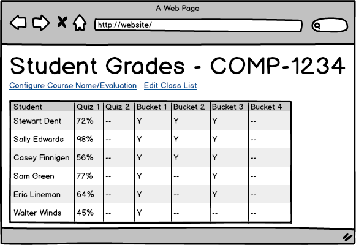
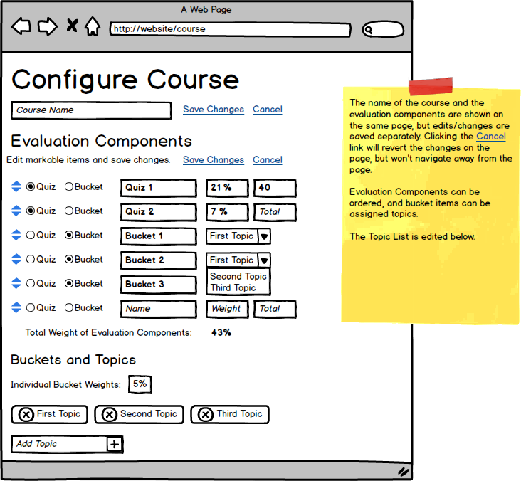
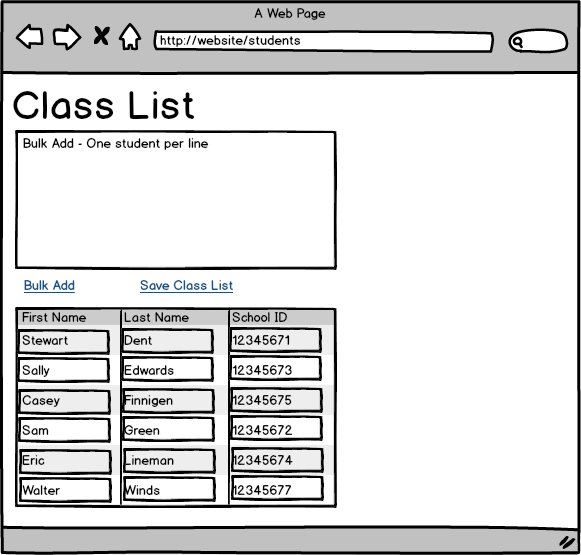
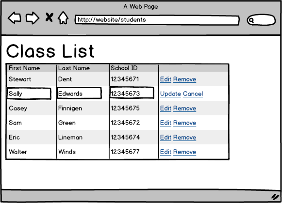

# Student Marks - Narrative

As an instructor, I need to track marks for my students. For any given course, this entails a few tasks. Firstly, as part of initializing my tracking, I need to know/enter my class list (student first/last name + school id) and know/enter the different things I need to get marked (mark item, weight, etc.). After that, I need to just enter my marks, which I would like to do in a "bulk" fashion.

* **Q)** Are there any rules around the values of marks?
  * **R)** Yes.
    * Total weighted marks must equal 100.
    * Non-pass/fail items will have a Total Potential Marks > 0
    * Earned Marks must be > 0 && <= Total Potential Marks
    * Total grade at end of course must be <= 100

* **Q)** Can you describe further what you mean when you say you enter your marks in "bulk"?
  * **R)** Basically, after I mark an item like a quiz, I have all the quiz marks for the class, and I want to just pull up a list of the students and enter each student's quiz mark, and then just save the marks after I've entered them.
  * *Implementation Note* - When it comes to entering marks for students, it would be easiest to be able to click the marked item and then just enter each student's mark by using tab/alt-tab to go from student to student, and then bulk-add the class marks for the marked item.

In my current situation, I have a course with two quizzes (21% and 7%) and a set of all-or-nothing exercises (24 worth 3% each and totalling to 72%). Each quiz can be out of a differnt set of marks; for example, the first quiz is out of 40 marks. Since the exercises are worth all-or-nothing, they don't have individual marks.

* **C)** I forgot to mention that the bucket exercises are grouped under topics (to make it easier to track). I tend to have anywhere from one to five buckets per topic, and I like to see the quizzes, topics and buckets ordered according to how they are delivered during the course.

* **Q)** Can you tell me more about the "all-or-nothing" exercises?
  * **R)** Those exercises are each marked as either a pass/fail. They are fairly easy to do, and for the most part student pass them when they try them. However, sometimes they don't, and I'll explcitly mark them as a fail.
    * *Note* Use **Pass/Fail** as part of the domain language to describe these types of marked items.
  * **Q)** You say that you explicitly mark them as a fail. Do you not enter all the marks (i.e., do you leave any "un-marked", or mark them as incomplete)?
  * **R)** I don't mark them as incomplete, I just don't enter any mark for that exercise. Then, at the end of the course, if there isn't a mark, it's assumed they didn't do it and therefore fail that exercise.
  * **R2** Oh, and sometimes I have to go back to earlier exercises to mark those that the student has turned in later on in the course.
  * **Q)** Are there any due-dates for the exercises?
  * **R)** Sometimes there are fixed due dates, but sometimes I just leave the due-dates open until later on in the course when I give the students a firm drop-dead date to hand in their exercises for marking. After that point, I don't accept late exercises (unless the student has a reason, such as illness or other "life" event).
* **Future** - *Look at these features in future releases*
  * Handle more alternate scenarios for the main stories
  * Handle other types of marked items - labs, group assignments, etc.
  * Track multiple courses - **This Version: *One Course Only*!**
  * Allow changing of course evaluation after marks have been partially entered (e.g.: replace a quiz with two smaller quizzes, or combine one or two labs)
  * Handle student-specific exceptions (combine/average lab mark if one missed, different potential marks for specific student)
  * Handle "bonus" marks (over 100%)
  * More UI cases for bulk-inserting student names (cases of middle names)

When I enter my list of students, it would be easier to just paste in all the student information as one "chunk" and have the system figure out [parse] what the student information is. There would be one student per line, and all the information on each line is separated by spaces, tabs, and/or commas. Each line has the student's name (typically *First Last*, ~~but perhaps with a middle name~~ **(*Note 1*)**) and then ends with the school id for the student.

* **Q)** How complex can the structures be for student names & school Ids?
  * **R)** Actually, this term it's pretty basic. Just *First*, *Last*, and *School ID*
  * **Q)** Can we just accept this simple structure this time around and add edge cases later?
  * **R)** Sure.
  * *Mark this characteristic as future in the narrative:* **(*Note 1*)**

* **C)** The screen mockups look nice!

## Screen Mockups

#### Home-Setup

#### Home-Student Marks

#### Course-Configure

#### Students-Setup

#### Students-Edit

## User Stories

**User Stories** become the basis for System Tests and/or Integration Tests. *All the following user stories are from the perspective of the Instructor, since this is only an Instructor tool at present. Therefore, it can be assumed to start with* **An an Instructor***.*

* *Initialize Course Information*
  * **I Want** to enter the mark structure for the course,
  * **So That** I have the basic framework to enter student marks.
    * *Scenario Title* (Primary)
      * **Given** something **When** action **Then** result
    * *Scenario Title*
      * **Given** something **When** action **Then** result
* *Generate Class List*
  * **I Want** to enter a list of students in my class,
  * **So That** I know who to assign marks to.
    * *Scenario Title* (Primary)
      * **Given** something **When** action **Then** result
    * *Scenario Title*
      * **Given** something **When** action **Then** result
* *Title*
  * **I Want** to enter student marks,
  * **So That** I can track each student's progress in the course.
    * *Scenario Title* (Primary)
      * **Given** something **When** action **Then** result
    * *Scenario Title*
      * **Given** something **When** action **Then** result

----

* *Title*
  * **I Want** ,
  * **So That** .
    * *Scenario Title* (Primary)
      * **Given** something **When** action **Then** result
    * *Scenario Title*
      * **Given** something **When** action **Then** result

----

## Unit Tests

**Unit Tests** are for smaller parts of the system and are done as "units". I'm breaking these down into tests related to the *Application Framework* and those related to the *User Interface* (in this case, a browser). There will also be unit tests to check aspects of the "seams" between the UI and the App Framework.

### App Framework Unit Tests

* [ ] C# class library unit tests, done in xUnit.

### UI Unit Tests

AngularJS functionality, tested with Jasmine.

* Includes tests for the presence of WebAPI
  * ClassController - REST-ful - get/post/put/delete student lists
  * EvaluationController - REST-ful - get/post/put/delete markable items
  * MarkController - REST-ful - get/post/put/delete student marks
* StudentController.BulkParse() - text as *Add Multiple*, then parse into separate entries
  * Parse Student Information (bulk insert) -  First, Last, SchoolID - *per line*
* StudentController.Update()
  * Flag for each student info to be *Changed* if their individual info was edited
* MarkController.BulkAdd()
  * List student names with text boxes or checkboxes for entering mark info (un-checked means no-data)

----

# Notes on Narratives

- Need icons in narrative to indicate discussions, comments, images, screen mockups, etc.
- Option to in-line discussions, comments, images, and/or screen mockups
